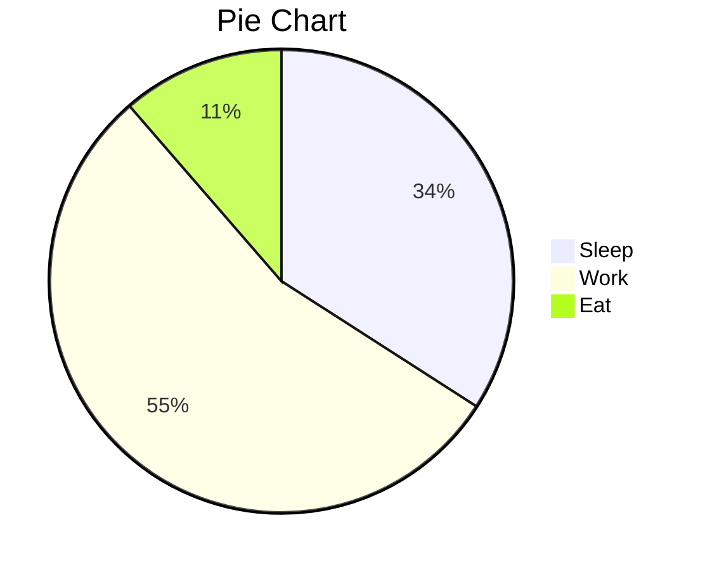

# OneLight

[TOC]

## 二级标题

### 三级标题

#### 四级标题

##### 五级标题

###### 六级标题

## 引用块

> ## 关雎
>
> 诗经·国风·周南〔先秦〕
>
> 关关雎鸠，在河之洲。窈窕淑女，君子好逑。
> 参差荇菜，左右流之。窈窕淑女，寤寐求之。
> 求之不得，寤寐思服。悠哉悠哉，辗转反侧。
> 参差荇菜，左右采之。窈窕淑女，琴瑟友之。
> 参差荇菜，左右芼之。窈窕淑女，钟鼓乐之。

## GitHub警告框

> [!NOTE]
>
> 行路难·其一
>
> 李白〔唐代〕
>
> 金樽清酒斗十千，玉盘珍羞直万钱。
> 停杯投箸不能食，拔剑四顾心茫然。
> 欲渡黄河冰塞川，将登太行雪满山。
> 闲来垂钓碧溪上，忽复乘舟梦日边。
> 行路难，行路难，多歧路，今安在？
> 长风破浪会有时，直挂云帆济沧海。

> [!TIP]
>
> 春望
>
> 杜甫〔唐代〕
>
> 国破山河在，城春草木深。
> 感时花溅泪，恨别鸟惊心。
> 烽火连三月，家书抵万金。
> 白头搔更短，浑欲不胜簪。

> [!IMPORTANT]
>
> 问君能有几多愁？恰似一江春水向东流。——李煜《虞美人·春花秋月何时了》

> [!WARNING]
>
> 醉后不知天在水，满船清梦压星河。——唐温如《题龙阳县青草湖》

> [!CAUTION]
>
> 洛阳亲友如相问，一片冰心在玉壶。——王昌龄《芙蓉楼送辛渐》

## 代码块

```javascript
export default defineConfig({
    plugins: [
        vue(),
        AutoImport({
            resolvers: [ElementPlusResolver()],
        }),
        Components({
            resolvers: [ElementPlusResolver()],
        }),
    ],
    resolve: {
        alias: {
            '@': fileURLToPath(new URL('./src', import.meta.url))
        }
    },
    //http proxy
    server: {
        host: 'localhost',
        port: 5173,
        proxy: {
            '/api': {
                target: 'http://localhost:8080', //backend
                changeOrigin: true,
                rewrite: (path) => path.replace(/^\/api/, '')
            }
        }
    },
})
```

## 列表

> 有、无序列表样式来自[dyzj](https://theme.typora.io/theme/dyzj/)主题，感谢作者muggledy

无序列表：


- 无
  - 无序
    - 无序列
      - 无序列表

有序列表：

1. 有
2. 有序
3. 有序列
4. 有序列表

任务列表：

- [ ] 未完成任务1
- [ ] 未完成任务2
- [x] 已完成任务1
- [x] 已完成任务2

## 文本

==文本高亮== __加粗__ *斜体* ==***斜体高亮加粗***== ~~删除线~~ <u>下划线</u> <span alt='highlight'>高亮</span> <kbd>Ctrl T</kbd>可以插入表格

## 表格

| 时间                | 人数 | 地点 |
| :------------------ | :--: | ---: |
| 2024-12-15 12:34:59 | 123  | 上海 |
| 2024-12-15 12:35:03 | 456  | 北京 |
| 2024-12-15 12:35:07 | 789  | 深圳 |
|                     |      |      |

## 图片 

图片默认居中显示，可以设置img标签的algin属性调整为左对齐或者右对齐

` `


## 数学公式

- 行内公式：这是一个数学公式 $\lim\limits_{x \to \infty} \exp(-x)=0$

- 行间公式：

$$
E_0 = mc^2 \\
\quad\text{—— Albert Einstein}
$$

## 链接

- 可以直接用尖括号包裹URL[链接]()或邮箱：<https://clb.pages.dev>

## 音频

<audio controls="controls">
  <source src="https://bin-music.netlify.app/songs/%E5%B0%8F%E3%81%95%E3%81%AA%E6%B5%B7-%E7%B5%90%E6%9D%9F%E3%83%90%E3%83%B3%E3%83%89.mp3" type="audio/mp3" />
</audio>


## mermaid


